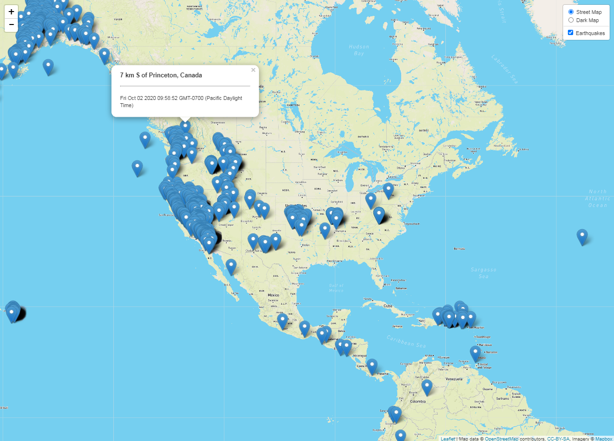

# Project Description

* Create a map using Leaflet.js and Google Maps that plots all of the earthquakes from the past 7 days based on their longitude and latitude using GeoJSON data from the the USGS GeoJSON Feed webpage.
  * Use the URL of this JSON to pull in the data for the visualization.
* Include popups that provide additional information about the earthquake when a marker is clicked.
* Create a legend that will provide context for your map data.

## Map

